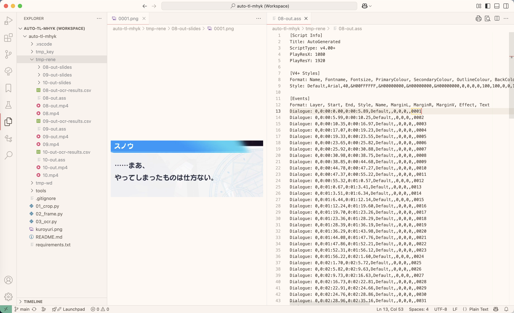

# auto-tl-mhyk

## 0 开发记录

开发者的手机在经过 `01_crop.py` 处理后的输出尺寸为 `1080*1920`，
后面的脚本基本上据此进行设计。
因此，可能会由于算数四舍五入出现效果不佳的情况，请酌情自行调整。

(2025-03-20) 发现部分老师用的尺寸远比 `1080*1920` 长，
增加了 `02_frame_294x640.py` 以适应此比例（黑边请自行裁切）。
如果需要其他尺寸可自行修改或向开发者提交可参考的录屏样例文件。
* **注意**：本地实在没有可供 `294x640` 脚本测试的录屏样例，所以完全没测过……


另外，由于本项目开发的初心是方便为卡牌 EP 录屏打轴，
对于主线剧情（时长较长）、活动剧情（部分帧对话框颜色淡化、展示卡牌插画），
可能会出现一些未知的不兼容问题。

有问题可以直接提 issue，
或者联系邮箱 [kmbk.kr.dev[AT]outlook.jp](mailto:kmbk.kr.dev@outlook.jp).

开发者水平有限，未必能解决问题，请放低期待。

## 1 目录结构

```
├── 01_crop.py         # 视频裁剪，使其适应 9:16 比例
├── 02_frame.py        # 从视频中提取帧，计算相似度，生成字幕
├── 03_ocr.py          # 对字幕图片进行 OCR 识别，并可选地翻译成中文
├── README.md          # 项目说明文档
├── kuroyuri.png       # 参考图像，用于相似度计算
├── requirements.txt   # 依赖包列表
└── tools/             # 开发者自用工具（介绍略）
```

再简要介绍一下三个脚本。
* `01_crop.py`: 负责将原始录屏转换为 9:16 的尺寸。（**如果原始尺寸大概是 `294*640` ，则跳过这一步骤**）
* `02_frame.py`: 接受上一个脚本输出的视频文件作为输入，输出带时轴的字幕文件（ass）。
* `03_ocr.py`: 接收上一个脚本的可选功能生成的 `slides` 目录作为输入，输出 OCR 的结果。

下载或 `git clone` 本仓库即可使用相关功能。

在开始使用前，请确保已使用以下命令安装相关依赖：

```sh
pip install -r requirements.txt
```

## 2. 分文件介绍

本项目包含多个脚本，分别用于视频裁剪、帧提取与相似度计算、OCR 识别与翻译等任务。

### 2.1 `01_crop.py`

**如果原始尺寸大概是 `294*640`，则跳过这一步骤。**

该脚本用于裁剪视频，将其裁剪为 `9:16` 比例并且内容无丢失的视频，并输出到新文件。
脚本会自动检测视频的裁剪参数，并使用 `ffmpeg` 进行处理。
理论上支持手机录屏和平板录屏的裁剪。

实际测试过的对象：
1. 原始文件 `width:height` 小于`9:16`的手机录屏
2. 平板录屏

**用法**
```sh
python script.py -i <输入视频路径> [-o <输出视频路径>]
```

**参数说明**
* `-i, --input`  : 输入视频文件路径（必填）。
* `-o, --output` : 输出视频文件路径（可选，默认在原文件名后加 -out）。

**处理逻辑**
1. 读取输入视频信息（宽度、高度）。
2. 若视频宽高比大于 9:16，则裁剪左右两侧。
3. 若视频宽高比小于 9:16，则自动检测最佳裁剪参数，并调整为 9:16。
4. 输出裁剪后的视频，保留音频。

**注意事项**
* 依赖 ffmpeg 进行视频处理，请确保其可用。
* 若未指定输出路径，默认生成 输入文件名-out.扩展名，避免覆盖原文件。
* 若输出文件已存在，自动添加 -new 避免冲突。
* 仅支持 ffmpeg 兼容的视频格式。

**使用示例** （请确保当前目录下有 `input.mp4` 文件）
```sh
python script.py -i input.mp4 -o output.mp4
```

### 2.2 `02_frame_*.py`
该脚本用于从视频中提取帧，应用锐化和二值化处理，并计算与参考图像的相似度，最终生成字幕文件。

可选地，还可提取关键帧，便于阅读。这个 `--slides` 功能的设计初衷是为了方便我和我的朋友阅读剧情，看竖屏幻灯片录屏实在太坐牢了。

**原理**

对话框右下角的黑百合图案在字幕加载完成时会闪动，通过监测该区域图形变化实现切帧打轴功能。
因此，当视频尺寸不符合预期时 (9:16)，识别的结果应该会非常不理想。

**Evaluation**

在个人笔记本上使用该脚本对 6min 50s 的一话活动剧情进行时轴操作，用时约 30s.

**用法**
```sh
python 02_frame_*.py --input <输入视频路径> [--output <输出目录>] [--debug] [--slides]
```

**参数说明**
* `--input`  : 输入视频文件路径（必填）。
* `--debug`  : 启用调试模式，保存临时帧图像及相似度数据（可选）。
* `--slides` : 生成高相似度间隔的幻灯片帧（可选）。

**处理逻辑**
1. 读取输入视频信息（帧率、宽度、高度）。
2. 确保视频 `width: height` 比为 `9:16`，否则终止处理。
3. 载入参考图像 `kuroyuri.png` 并转换为灰度图。
4. 逐帧读取视频：
    - 裁剪目标区域
    - 应用锐化处理
    - 进行二值化
    - 计算与参考图像的相似度
5. 根据相似度数据识别高相似度区间，生成字幕文件 (`.ass`)。
6. 若启用 `--slides`，提取高相似度间隔的代表帧作为幻灯片。

**注意事项**
* 依赖 `opencv-python` 进行图像处理，请确保其已安装。
* 需要 `kuroyuri.png` 作为参考图像，需放置在脚本目录下。
* 若启用 `--debug`，输出目录中会保存处理后的帧图像和 `_a.csv` 相似度数据表。
* 生成的字幕文件将与输入视频同目录，文件名与视频同名，扩展名为 `.ass`。
* `--slides` 选项会在输入视频目录创建 `{video}-slides` 文件夹，保存幻灯片帧。

**使用示例**
```sh
python 02_frame_9x16.py --input input.mp4 --debug --slides
```

### 2.3 `03_ocr.py`
该脚本用于从上一节得到的 `{video}-slides` 目录下的图像中提取字幕文本。
它使用 paddleOCR 识别字幕内容。

输出的 CSV 文件可以直接用表格处理软件打开，如果发生任何编码问题请自行查阅相关资料解决。

做这个脚本是主要为了方便对轴，不过做完了发现不怎么用得上。

**Evaluation**

在个人笔记本上使用该脚本对 6min 50s 的一话活动剧情用上一节的脚本生成的 `{video}-slides` 目录进行 OCR 操作，用时约 1min 47s.

**警告：虽然提供了 `--chn` 选项但是不建议使用，效果实在是太烂了。由于优化工作繁琐细碎且优化空间有限，所以开发者后续并不打算使用或优化这个功能。**

**用法**
```sh
python 03_ocr.py --slides-path <slides目录路径> [--chn]
```

**参数说明**
* `--slides-path` : 幻灯片帧所在的目录路径（必填）。
* `--chn`         : 启用日语到中文的自动翻译（可选）。

**处理逻辑**
1. 读取 `slides-path` 目录下的 PNG 图片。
2. 依次进行 OCR 识别，提取文本内容：
    - 自动检测角色名称，并替换为英文名称。
    - 进行额外的单行 OCR，提高准确度。
    - 计算字符串相似度，优化文本结果。
3. 生成 CSV 文件，记录提取的日语字幕。
4. 若启用 `--chn`，对识别的文本进行日语到中文翻译，并追加至 CSV 文件。

**注意事项**
* 依赖 `paddleocr` 进行 OCR 识别，请确保其已安装。
* 默认会在 `slides-path` 的同级目录生成 `{video}-ocr-results.csv` 作为输出文件。
* `--chn` 选项使用 `translate` 库进行翻译，翻译质量有限。

**使用示例**
```sh
python 03_ocr.py --slides-path slides/ --chn
```

## 闲聊

前面忘了后面忘了，来都来了不如看看我家的*打轴*工作区：

