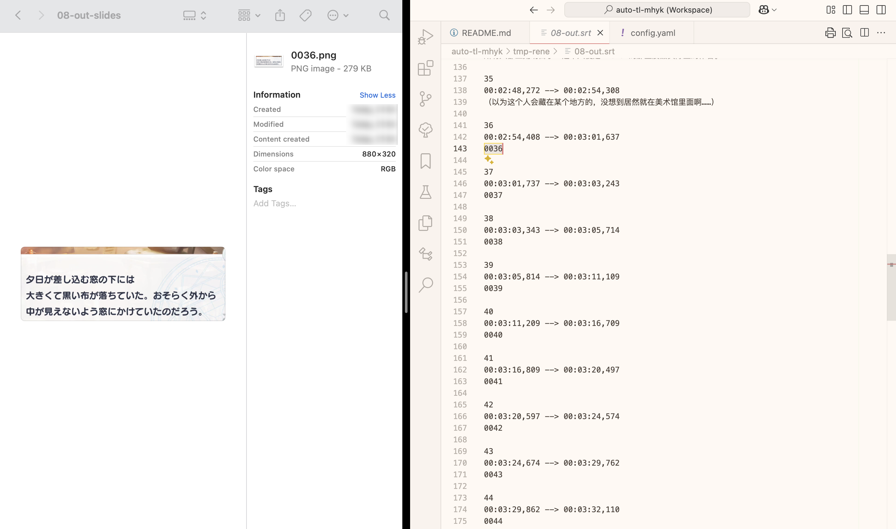

# auto-tl-mhyk

>有问题可以直接提 issue，
>或者联系邮箱 [kmbk.kr.dev[AT]outlook.jp](mailto:kmbk.kr.dev@outlook.jp).

## ⚠️ 目前已知的问题


1. 分辨率/视频尺寸适配

开发者的手机在经过 `01_crop.py` 处理后输出的比例为 `9:16`，
后面的脚本基本上据此进行设计。
因此，可能会由于算数四舍五入出现效果不佳的情况，请酌情自行调整。

(2025-03-23) 发现部分老师用的尺寸并非 `9:16` ，
增加了 `9:19.5` 的适配（但由于缺少测试用例，该模式未经充分测试）

>如果需要其他尺寸，可自行修改 `02_frame.py`，增加相关选项和配置；
>也可向开发者提交可参考的录屏示例文件。

2. 比较适合识别单话（极限可能是12分钟左右），不适合一次性识别较长的剧情。

原因可能是触及了opencv或者ffmpeg库的某种限制，但并不是很确定。
触发此问题是因为想把三个视频合并了一起轴（大约20分钟），结果轴的准确率大大降低。

## 1 目录结构（部分）

```
├── 01_crop.py         # 视频裁剪，使其适应 9:16 或 9:19.5 比例
├── 02_frame.py        # 从视频中提取帧，计算相似度，生成字幕
├── 03_ocr.py          # 对字幕图片进行 OCR 识别，并可选地翻译成中文
├── README.md          # 项目说明文档
├── kuroyuri.png       # 参考图像，用于相似度计算
├── requirements.txt   # 依赖包列表
└── tools/             # 开发者自用工具（介绍略）
```

再简要介绍一下三个脚本。
* `01_crop.py`: 负责将原始录屏转换为 `9:16` 或 `9:19.5` 的尺寸。
* `02_frame.py`: 接受上一个脚本输出的视频文件作为输入，输出带时轴的字幕文件(srt)。
* `03_ocr.py`: 接收上一个脚本的可选功能生成的 `slides` 目录作为输入，输出 OCR 的结果。

下载或 `git clone` 本仓库即可使用相关功能。

在开始使用前，请确保已使用以下命令安装相关依赖：

```sh
pip install -r requirements.txt
```

## 2 分文件介绍

本项目包含多个脚本，分别用于视频裁剪、帧提取与相似度计算、OCR 识别与翻译等任务。

### 2.1 `01_crop.py`

**如果原始尺寸大概是 `9:19.5`，则跳过这一步骤。**

该脚本用于裁剪视频，将其裁剪为 `9:16` 或 `9:19.5` 比例并且内容无丢失的视频，并输出到新文件。
脚本会自动检测视频的裁剪参数，并使用 `ffmpeg` 进行处理。
理论上支持手机录屏和平板录屏的裁剪。

实际测试过的对象：
1. 原始文件 `width:height` 小于`9:16`的手机录屏
2. 平板录屏

**用法**
```sh
python 01_crop.py -i <输入视频路径> [-o <输出视频路径>] [--mode <目标比例>]
```

**参数说明**
* `-i, --input`  : 输入视频文件路径（必填）。
* `-o, --output` : 输出视频文件路径（可选，默认在原文件名后加 -out）。
* `--mode`       : 设置目标比例，可以为 `9_16` 或 `9_19.5`（可选）。

**处理逻辑**
1. 读取输入视频信息（宽度、高度）。
2. 若视频宽高比大于指定比例（更扁），则裁剪左右两侧。
3. 若视频宽高比小于指定比例（更长），则自动检测最佳裁剪参数，并调整为 `9:16` 或 `9:19.5`。
4. 输出裁剪后的视频，保留音频。

**注意事项**
* 依赖 ffmpeg 进行视频处理，请确保其可用。
* 若未指定输出路径，默认生成 输入文件名-out.扩展名，避免覆盖原文件。
* 若输出文件已存在，自动添加 -new 避免冲突。
* 仅支持 ffmpeg 兼容的视频格式。

**使用示例** （请确保当前目录下有 `input.mp4` 文件）
```sh
python 01_crop.py -i input.mp4 -o output.mp4 --mode 9_19.5
```

### 2.2 `02_frame.py`
该脚本用于从视频中提取帧，应用锐化和二值化处理，并计算与参考图像的相似度，最终生成字幕文件。

可选地，还可提取关键帧，便于阅读。这个 `--slides` 功能的设计初衷是为了方便我和我的朋友阅读剧情，看竖屏幻灯片录屏实在太坐牢了。

⭐️ **原理**

对话框右下角的黑百合图案在字幕加载完成时会闪动，通过监测该区域图形变化实现切帧打轴功能。
因此，当视频尺寸不符合预期时 (`9:16` 或 `9:19.5`)，识别的结果应该会非常不理想
->所以直接选择拒绝识别。

**Evaluation**

在个人笔记本上使用该脚本对 6min 50s 的一话活动剧情进行时轴操作，用时约 30s.

**用法**
```sh
python 02_frame.py --input <输入视频路径> [--output <输出目录>] [--debug] [--slides]
```

**参数说明**
* `--input`  : 输入视频文件路径（必填）。
* `--debug`  : 启用调试模式，保存临时帧图像及相似度数据（可选）。
    * 启用时，处理后的帧图像和相似度数据将保存至视频所在目录下的 `tmp_debug_frame/` 文件夹。
* `--slides` : 生成高相似度间隔的幻灯片帧（可选）。

**处理逻辑**
1. 读取输入视频信息（帧率、宽度、高度）。
2. 自动识别视频的宽高比（支持 `9:16` 与 `9:19.5`），并加载对应预设参数。
3. 载入参考图像 `kuroyuri.png`（路径可在脚本最上方手动修改），并转换为灰度图。
4. 逐帧读取视频：
    - 裁剪目标区域
    - 应用锐化处理
    - 进行二值化
    - 计算与参考图像的相似度
5. 根据相似度数据识别高相似度区间，生成字幕文件 (`.srt`)。
6. 若启用 `--slides`，提取高相似度间隔的代表帧作为幻灯片。

**注意事项**
* 依赖 `opencv-python` 进行图像处理，请确保其已安装。
* 默认使用 `kuroyuri.png` 作为参考图像，路径和相似度阈值均可在脚本顶部常量中手动修改。
* 若启用 `--debug`，输出目录中会保存处理后的帧图像和 `_a.csv` 相似度数据表（位于输入视频目录下的 `tmp_debug_frame` 文件夹中）。
* 生成的字幕文件将与输入视频同目录，文件名与视频同名，扩展名为 `.srt`。
* `--slides` 选项会在输入视频目录创建 `{video}-slides` 文件夹，保存幻灯片帧。

**使用示例**
```sh
python 02_frame.py --input input.mp4 --debug --slides
```

#### 💡 进阶：自定义参考图像与相似度阈值（kuroyuri.png & THRESHOLD_RATIO）

`THRESHOLD_RATIO` 是一个介于 0 到 1 之间的浮点数，用于判断当前帧与参考图像的相似程度是否足够高，足以触发“打轴”判断。
默认值为 `0.97`，也就是说只有相似度高于 0.97 的帧才会被视为“与参考图像匹配”。

阈值越高，只有与参考图像非常相似的帧才会触发识别；阈值越低，则更容易触发，但可能会误识别噪点。

在某些情况下，例如参考图像正是从当前视频中截取时，建议将该值调高至 `0.99` 甚至 `1.0`，以避免误判。

如果你发现默认的 `kuroyuri.png` 无法正确识别闪图，或者使用的录屏尺寸较为特殊，可以使用 `--debug` 模式来生成你自己的参考图像。

**步骤如下：**
1. 使用 `--debug` 模式运行 `02_frame.py`，例如：
   ```sh
   python 02_frame.py --input input.mp4 --debug
   ```
2. 进入输出目录，找到某一帧中图像清晰显示黑百合图案的图片（一般为类似 `frame_xxx.png` 的文件）。
3. 使用任意图片编辑工具（如截图工具）将黑百合区域裁剪出来，保存为 `kuroyuri.png`（或任意你喜欢的名称），替换脚本中 `KUROYURI_PATH` 的值。

**提示：**
- 如果你从当前视频中提取了参考图像，为了提高检测准确度，建议将 `THRESHOLD_RATIO` 提高到 `0.99` 或更高（甚至 `1.0`！），例如：
  ```python
  THRESHOLD_RATIO = 0.995
  ```
- 你可以在 `02_frame.py` 脚本顶部修改 `KUROYURI_PATH` 与 `THRESHOLD_RATIO` 。

### 2.3 `03_ocr.py`
该脚本用于从上一节得到的 `{video}-slides` 目录下的图像中提取字幕文本。
它使用 paddleOCR 识别字幕内容。

输出的 CSV 文件可以直接用表格处理软件打开，如果发生任何编码问题请自行查阅相关资料解决。

做这个脚本是主要为了方便对轴，不过做完了发现不怎么用得上。

**Evaluation**

在个人笔记本上使用该脚本对 6min 50s 的一话活动剧情用上一节的脚本生成的 `{video}-slides` 目录进行 OCR 操作，用时约 1min 47s.

**警告：虽然提供了 `--chn` 选项但是不建议使用，效果实在是太烂了。由于优化工作繁琐细碎且优化空间有限，所以开发者后续并不打算使用或优化这个功能。**

**用法**
```sh
python 03_ocr.py --slides-path <slides目录路径> [--chn]
```

**参数说明**
* `--slides-path` : 幻灯片帧所在的目录路径（必填）。
* `--chn`         : 启用日语到中文的自动翻译（可选）。

**处理逻辑**
1. 读取 `slides-path` 目录下的 PNG 图片。
2. 依次进行 OCR 识别，提取文本内容：
    - 自动检测角色名称，并替换为英文名称。
    - 进行额外的单行 OCR，提高准确度。
    - 计算字符串相似度，优化文本结果。
3. 生成 CSV 文件，记录提取的日语字幕。
4. 若启用 `--chn`，对识别的文本进行日语到中文翻译，并追加至 CSV 文件。

**注意事项**
* 依赖 `paddleocr` 进行 OCR 识别，请确保其已安装。
* 默认会在 `slides-path` 的同级目录生成 `{video}-ocr-results.csv` 作为输出文件。
* `--chn` 选项使用 `translate` 库进行翻译，翻译质量有限。

**使用示例**
```sh
python 03_ocr.py --slides-path slides/ --chn
```

## 闲聊

前面忘了后面忘了，来都来了不如看看我家的*打轴*工作区：

